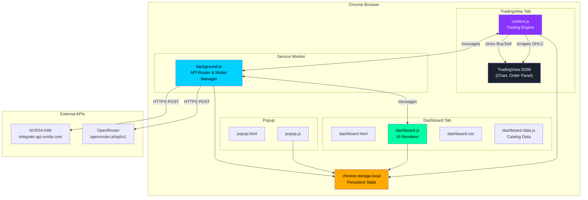
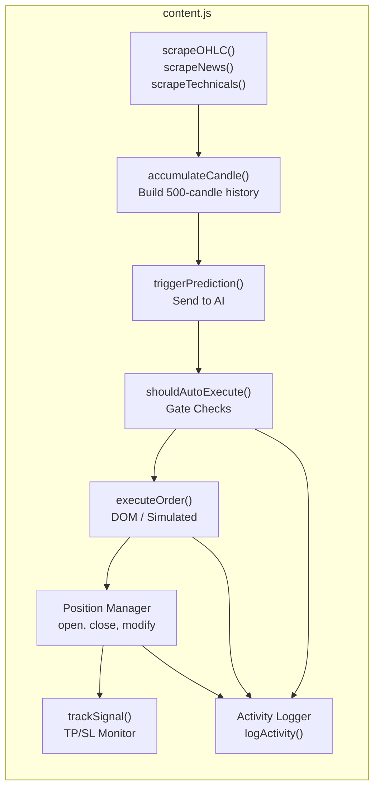
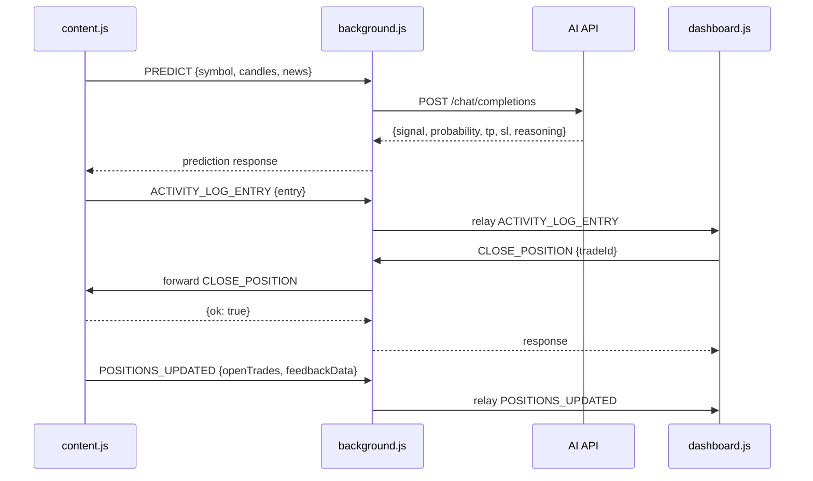
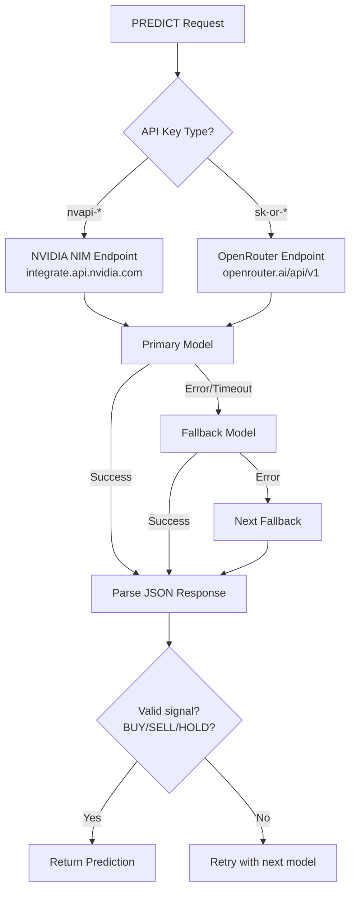
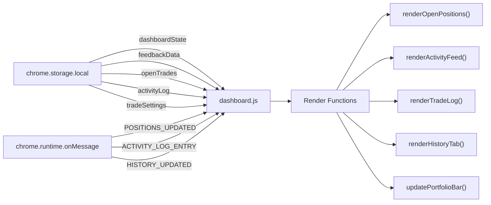
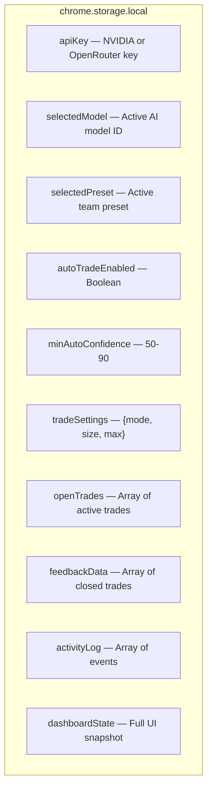
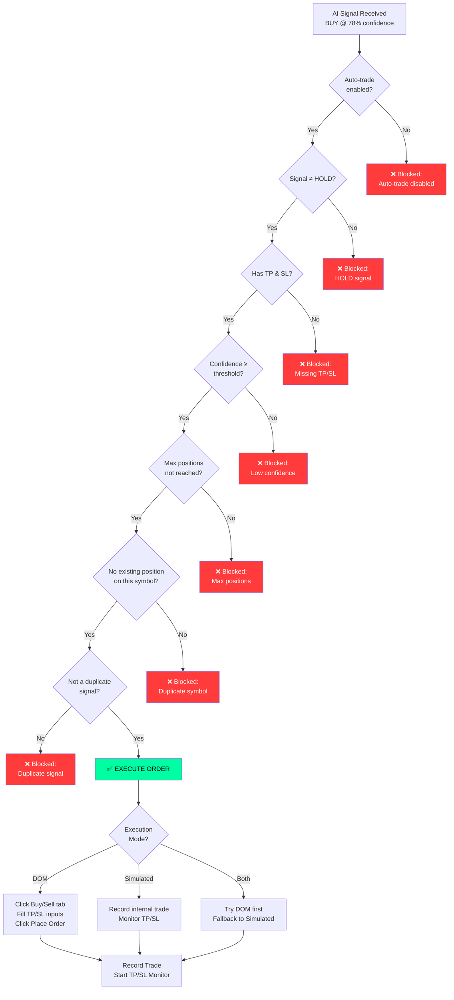
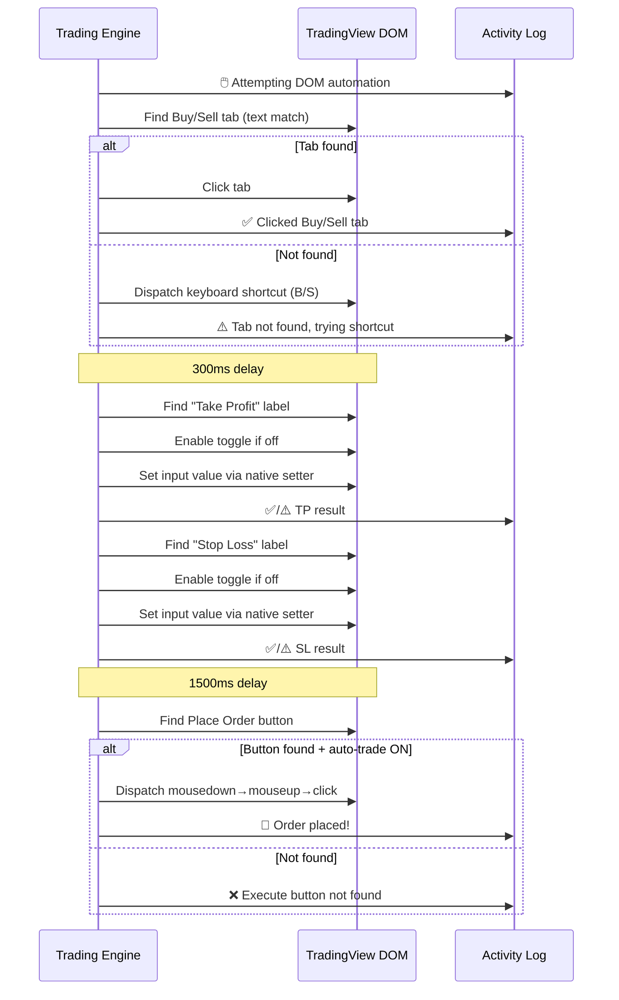
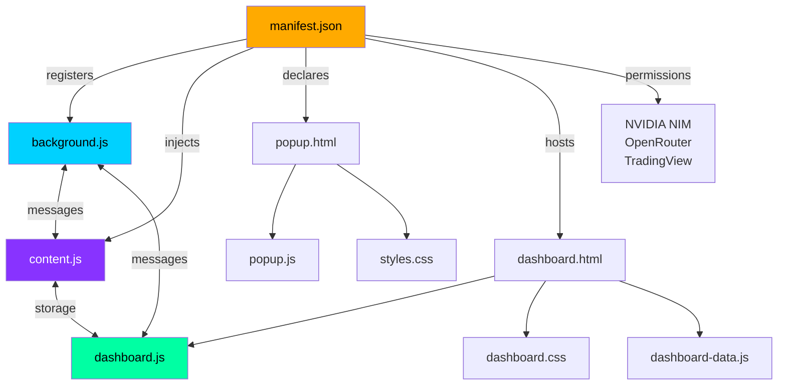

# 🏗️ Architecture — TV Trade

## System Overview

TV Trade is a **Chrome Extension (Manifest V3)** with four main layers: the TradingView content script, the background service worker, the dashboard UI, and the popup.

---

## Component Breakdown

### 1. Content Script — `content.js` (Trading Engine)

The core brain. Injected into every `tradingview.com/chart/*` page.

**Key Responsibilities:**
| Function | Purpose |
|----------|---------|
| `scrapeOHLC()` | Reads Open/High/Low/Close from TradingView legend DOM |
| `scrapeNews()` | Extracts headline text from news widgets |
| `scrapeTechnicals()` | Reads speedometer gauge (Buy/Sell/Neutral) |
| `accumulateCandle()` | Builds rolling 500-candle price history |
| `triggerPrediction()` | Packages data → sends to background.js for AI |
| `shouldAutoExecute()` | 7-point gate check before auto-trading |
| `executeOrder()` | Routes to DOM or simulated execution |
| `autoFillOrderPanel()` | DOM automation: click tabs, fill inputs, submit |
| `simulateOrder()` | Internal paper trade recording |
| `trackSignal()` | Monitors price every 5s for TP/SL hits |
| `closePosition()` | Closes trade, calculates P&L, moves to history |
| `logActivity()` | Writes timestamped event to activity feed |
| `broadcastDashboardState()` | Pushes full state to dashboard via storage + messages |

---

### 2. Service Worker — `background.js` (API Router)

Persistent background process handling AI API calls and message routing.

**Message Types Handled (20+):**

| Message | Direction | Purpose |
|---------|-----------|---------|
| `PREDICT` | CS → BG → API | Request AI prediction |
| `TOGGLE_AI` | DJ → BG → CS | Enable/disable AI engine |
| `TOGGLE_AUTO_TRADE` | DJ → BG → CS | Enable/disable auto-trading |
| `TRIGGER_PREDICT` | DJ → BG → CS | Manual prediction request |
| `CLOSE_POSITION` | DJ → BG → CS | Close a specific trade |
| `MODIFY_POSITION` | DJ → BG → CS | Update TP/SL on a trade |
| `CLOSE_ALL_POSITIONS` | DJ → BG → CS | Close all open trades |
| `UPDATE_TRADE_SETTINGS` | DJ → BG → CS | Change mode/size/max |
| `GET_POSITIONS` | DJ → BG → CS | Fetch current positions |
| `GET_ACTIVITY_LOG` | DJ → BG → CS | Fetch activity history |
| `GET_EXPORT_DATA` | DJ → BG → CS | Fetch candles for export |
| `ACTIVITY_LOG_ENTRY` | CS → BG → DJ | Real-time activity event |
| `POSITIONS_UPDATED` | CS → BG → DJ | Live position/P&L update |
| `HISTORY_UPDATED` | CS → BG → DJ | Trade closed notification |
| `DASHBOARD_BROADCAST` | CS → storage | Full state snapshot |
| `CHART_READY` | CS → BG | Chart tab connected |

**AI API Flow:**

---

### 3. Dashboard — `dashboard.html` + `dashboard.js`

Full-page UI rendered in its own Chrome tab.

```mermaid
graph TD
    subgraph DashboardLayout["Dashboard Layout"]
        HEADER["Header Bar<br/>Logo, Connection Status, Link"]
        PORTFOLIO["Portfolio Summary Bar<br/>8 metrics always visible"]

        subgraph Sidebar["Sidebar (sticky)"]
            ENGINE["AI Engine Select"]
            PRESET["Swarm Preset Select"]
            AUTO["Auto-Trade Toggle + Confidence"]
            SETTINGS["Trade Settings<br/>Mode, Size, Max Positions"]
            ENGINES["7 Backtest Engines List"]
        end

        subgraph Tabs["Main Content (10 tabs)"]
            T1["Signal Tab<br/>Signal, Confidence, TP/SL, Calculator"]
            T2["Positions Tab<br/>Open trades table (12 cols)"]
            T3["Activity Tab<br/>Live event feed with filter"]
            T4["Trade Log Tab<br/>History table (15 cols) + Export"]
            T5["Swarm Tab<br/>Multi-agent visualization"]
            T6["Teams Tab<br/>29 team presets"]
            T7["Skills Tab<br/>71 skills by category"]
            T8["History Tab<br/>Equity curve + W/L"]
            T9["Backtest Tab<br/>7 engines + stats"]
            T10["Export Tab<br/>Pine/TDX/MT5/JSON"]
        end

        FOOTER["Footer"]
    end

    HEADER --> PORTFOLIO --> Sidebar
    Sidebar --> Tabs --> FOOTER
```

**Data Flow into Dashboard:**

---

### 4. Popup — `popup.html` + `popup.js`

Lightweight browser-action popup for quick API key setup and toggle controls.

---

## State Management

All persistent state lives in `chrome.storage.local`:

---

## Auto-Trade Execution Flow

---

## DOM Automation Detail

---

## File Dependency Graph

---

## AI Model Inventory (16 Models)

### NVIDIA NIM (9 models)
| Priority | Model ID | Parameters |
|----------|----------|------------|
| 1 | `nvidia/llama-3.3-nemotron-super-49b-v1.5` | 49B |
| 2 | `deepseek-ai/deepseek-v4-pro` | — |
| 3 | `meta/llama-4-maverick-17b-128e-instruct` | 17B (128 experts) |
| 4 | `z-ai/glm-5.1` | — |
| 5 | `qwen/qwen3-coder-480b-a35b-instruct` | 480B (35B active) |
| 6 | `mistralai/mistral-large-3-675b-instruct-2512` | 675B |
| 7 | `nvidia/nemotron-3-super-120b-a12b` | 120B (12B active) |
| 8 | `meta/llama-3.3-70b-instruct` | 70B |
| 9 | `moonshotai/kimi-k2.6` | — |

### OpenRouter (7 models)
| Priority | Model ID | Cost |
|----------|----------|------|
| 1 | `moonshotai/kimi-k2.6:free` | Free |
| 2 | `deepseek/deepseek-v4-flash` | Free |
| 3 | `qwen/qwen3-coder:free` | Free |
| 4 | `nvidia/nemotron-3-super-120b-a12b:free` | Free |
| 5 | `minimax/minimax-m2.5:free` | Free |
| 6 | `z-ai/glm-4.5-air:free` | Free |

When **Auto** is selected, models are tried in priority order. If one fails (error, timeout, rate limit), the next model in the chain is attempted automatically.

---

## Technology Stack

| Layer | Technology |
|-------|-----------|
| Platform | Chrome Extension (Manifest V3) |
| Language | Vanilla JavaScript (ES2022) |
| Styling | Vanilla CSS (950+ lines, dark theme, glassmorphism) |
| Storage | `chrome.storage.local` (10 state keys) |
| Messaging | `chrome.runtime.sendMessage` / `onMessage` (20+ types) |
| AI Models | NVIDIA NIM API (9 models), OpenRouter API (7 models) |
| DOM Interaction | `querySelector`, native input setters, `MouseEvent` dispatch |
| Charts | HTML5 Canvas (equity curve) |
| Export | CSV, JSON, Pine Script v5, MQL5, TDX |
